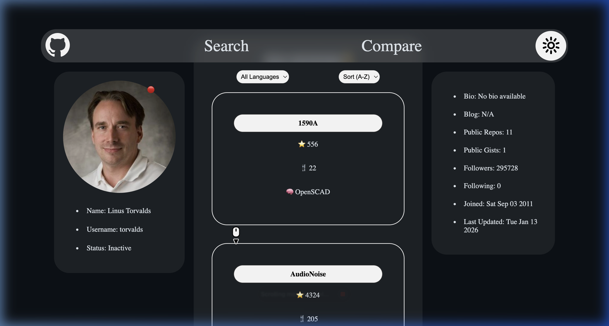
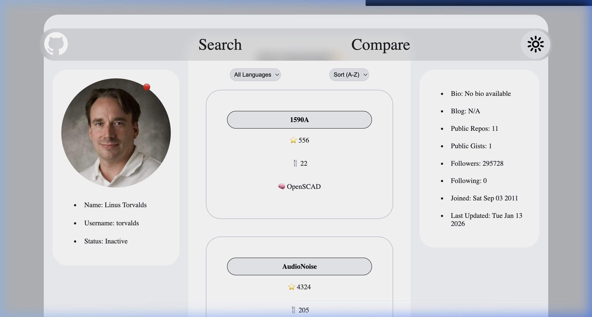

# 🔍 GitHub Profile Finder

A premium, modern web application designed to explore GitHub profiles with ease. Featuring a sleek **Glassmorphism** UI, real-time repository filtering, and dynamic theme switching, this tool provides a seamless experience for developers to discover and compare GitHub users.

---

## 🎨 Design Philosophy
This project prioritizes **Rich Aesthetics** and **Responsive Design**:
- **Glassmorphism**: Blurred backgrounds and vibrant gradients for a modern, high-end feel.
- **Dynamic UI**: Hover effects, smooth transitions, and micro-animations.
- **Theme Support**: Seamlessly toggle between dark and light modes with persistent settings.

---

## ✨ Features

### 🚀 Core Functionality
- **User Discovery**: Fetch real-time data from the GitHub REST API by entering any username.
- **Interactive Profile Cards**: View avatars, bios, social stats (followers/following), and joining dates.
- **Active Status Indicator**: Live 🟢/🔴 indicator based on the user's recent activity (within 7 days).

### 📦 Repository Explorer
- **Live Filtering**: Filter repositories by programming language instantly.
- **Smart Sorting**: Organize repositories alphabetically (A-Z or Z-A).
- **Stat Tracking**: View stars, forks, and primary languages for every repository.

### 🌗 Dark & Light Modes
- User-friendly theme toggle with logic to remember your preference across sessions using `localStorage`.

---

## 📸 Visuals

### Dark Mode (Default)


### Light Mode


---

## 🛠️ Tech Stack

- **HTML5**: Semantic structure for accessibility and SEO.
- **Vanilla CSS**: Custom design system featuring CSS variables and backdrop filters.
- **JavaScript (ES6+)**: 
  - Asynchronous data fetching with `fetch`.
  - Advanced Array methods (`map`, `filter`, `sort`) for data manipulation.
  - Zero traditional loops (`for`/`while`) — strictly functional approach.
- **GitHub REST API**: Reliable source for real-time user data.

---

## 📂 Project Structure

- `index.html`: The core structure and navigation.
- `GitHub_Profile_Finder.js`: API integration, rendering logic, and theme management.
- `GitHub_Profile_Finder.css`: Custom design tokens, glassmorphism styles, and responsiveness.
- `public/`: Assets including SVG icons and preview images.

---

## 🚀 Getting Started

1. **Clone the repository**:
   ```bash
   git clone https://github.com/Rajkshitiz2004/GithubProfileFinder.git
   ```
2. **Open the project**:
   Simply open `index.html` in your favorite web browser.

---

## 📝 Deliverables
- [x] Fully functional interactive UI.
- [x] Dynamic data rendering via GitHub API.
- [x] Advanced features (Language filter, Sorting).
- [x] Persistent Theme Toggle.
- [x] Clean, modular code structure.

---

Developed with ❤️ by [Kshitiz Raj](https://github.com/Rajkshitiz2004)
